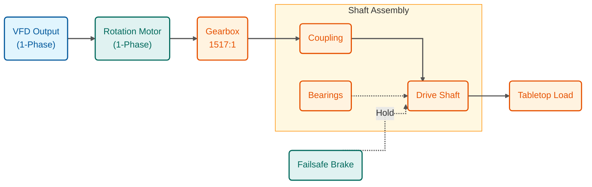
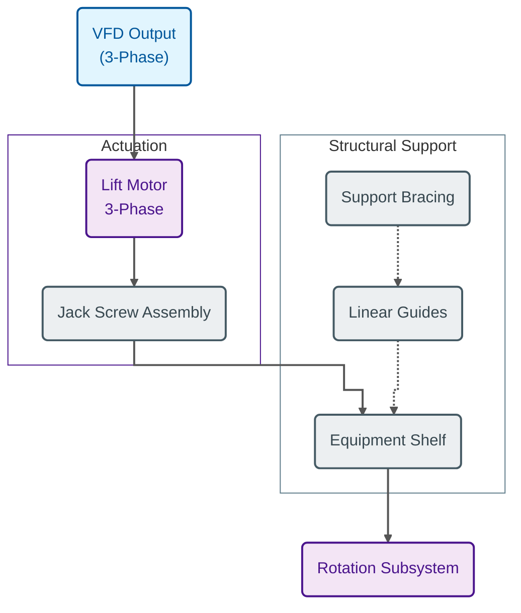
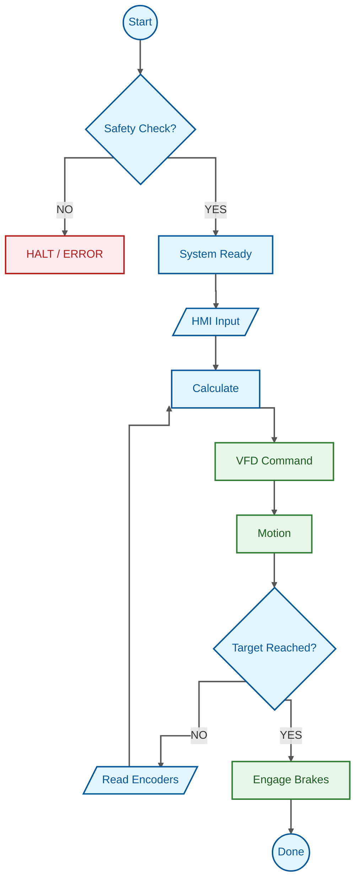

# Fliptable System Architecture

## Overall System Diagram

```mermaid
flowchart TD
    %% Global Graph Settings
    %% "stepAfter" creates orthogonal/manhattan style lines
    linkStyle default interpolate stepAfter stroke:#555,stroke-width:2px;

    %% Class Definitions - Professional Palette
    classDef control fill:#e1f5fe,stroke:#01579b,stroke-width:2px,color:#01579b;
    classDef power fill:#ffebee,stroke:#b71c1c,stroke-width:2px,color:#b71c1c;
    classDef lift fill:#f3e5f5,stroke:#4a148c,stroke-width:2px,color:#4a148c;
    classDef rot fill:#e0f2f1,stroke:#00695c,stroke-width:2px,color:#00695c;
    classDef struct fill:#eceff1,stroke:#455a64,stroke-width:2px,stroke-dasharray: 5 5,color:#37474f;
    classDef sensor fill:#fff3e0,stroke:#e65100,stroke-width:2px,color:#e65100;

    %% ==========================================
    %% 1. Power Distribution (Top Level)
    %% ==========================================
    subgraph Power_System [Power Distribution]
        direction TB
        Mains(("Main Power<br/>3Ph 240V")):::power
        Breaker["Main Breaker &<br/>E-Stop"]:::power
    end
    style Power_System fill:#ffffff,stroke:#b71c1c,stroke-width:2px,stroke-dasharray: 5 5

    %% ==========================================
    %% 2. Control System (Left Side)
    %% ==========================================
    subgraph Control_System [Control Cabinet]
        direction TB
        PLC["Main PLC<br/>Controller"]:::control
        HMI["HMI Panel"]:::control
        Comm("EtherNet/IP<br/>Bus"):::control
        
        %% Actuator Drivers
        subgraph Drives [Motor Drivers]
            direction TB
            VFD_Lift["Lift Drive<br/>(3-Phase)"]:::control
            VFD_Rot["Rotation Drive<br/>(1-Phase)"]:::control
            Relay["Brake Relay"]:::control
        end
        style Drives fill:#e1f5fe,stroke:#0277bd,stroke-width:1px
    end
    style Control_System fill:#ffffff,stroke:#0277bd,stroke-width:2px

    %% ==========================================
    %% 3. Lifting Subsystem (Container for Rotation)
    %% ==========================================
    subgraph Lift_System [Lifting Subsystem]
        direction TB
        
        %% Lifting Components
        LiftMotor("Lift Motor<br/>(3-Phase)"):::lift
        JackScrew("Jack Screw<br/>Assembly"):::lift
        
        %% Structure
        subgraph Structure [Structural Frame]
            direction TB
            Guides("Linear Guides"):::struct
            Bracing("Support Bracing"):::struct
            Shelf("Moving Shelf / Platform"):::struct
        end
        style Structure fill:#f5f5f5,stroke:#607d8b,stroke-width:1px

        %% NESTED ROTATION SUBSYSTEM (Physically on the Shelf)
        subgraph Rot_System [Rotation Subsystem (On Shelf)]
            direction TB
            RotMotor("Rot Motor<br/>(1-Phase)"):::rot
            Gearbox("Gearbox<br/>1517:1"):::rot
            Drivetrain("Coupling &<br/>Bearings"):::rot
            Shaft("Main Shaft"):::rot
            Tabletop("Tabletop Load"):::rot
            Brake("Failsafe Brake"):::rot
        end
        style Rot_System fill:#ffffff,stroke:#00695c,stroke-width:2px
        
    end
    style Lift_System fill:#ffffff,stroke:#4a148c,stroke-width:2px


    %% ==========================================
    %% 4. Feedback Sensors
    %% ==========================================
    subgraph Sensors_System [Sensors]
        LimitSw("Limit Switches"):::sensor
        Encoder("Rotary Encoders"):::sensor
    end
    style Sensors_System fill:#ffffff,stroke:#ef6c00,stroke-width:2px


    %% ==========================================
    %% CONNECTIONS
    %% ==========================================

    %% Power Flow
    Mains ==O Breaker
    Breaker ==> PLC
    Breaker ==> VFD_Lift
    Breaker ==> VFD_Rot

    %% Control Flow
    HMI <--> Comm
    Comm <--> PLC
    PLC --> Drives
    
    %% Drive Connections
    VFD_Lift ==> LiftMotor
    VFD_Rot ==> RotMotor
    Relay -.-> Brake

    %% Lifting Mechanics
    LiftMotor ==> JackScrew
    JackScrew ==> Shelf
    Guides -.-> Shelf
    Bracing -.-> Guides

    %% Support Relationship
    Shelf == "Holds" ==> RotMotor

    %% Rotation Mechanics
    RotMotor ==> Gearbox
    Gearbox ==> Drivetrain
    Drivetrain ==> Shaft
    Brake -.-> Shaft
    Shaft ==> Tabletop

    %% Feedback
    LimitSw -- "Safety" --> PLC
    Encoder -- "Feedback" --> PLC
```

---

## Detailed Subsystem Breakdown

### 1. Rotation Subsystem Diagram



### 2. Lifting Subsystem Diagram



### 3. Control Logic Flow


